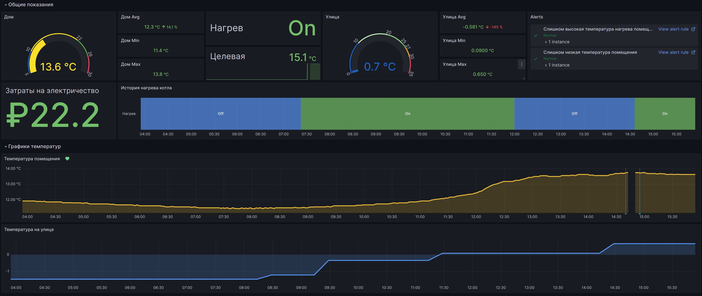

# MyHeat Prometheus exporter
Экспортер метрик в Prometheus для оборудования, управляемого системами https://myheat.net.
Это различное нагревательное оборудование, котлы, насосы, датчики, часто использующиеся в частных домах.

Сейчас умеет экспортировать следующие метрики:
- Температура помещения `myheat_env_temp_current`
- Целевая температура помещения `myheat_env_temp_target`
- Происходит нагрев для достижения целевой температуры `myheat_env_heat_demand`
- Температура на улице `myheat_dev_weather_temp`
- Общее время котла во включенном состоянии `myheat_env_heat_demand_seconds_total`. Используется для подсчета энергопотребления

# Запуск
Для запуска экспортера достаточно собрать образ и запустить контейнер.

Переменные окружения:
- `MYHEAT_KEY` - Токен из личного кабинета
- `MYHEAT_LOGIN` - Логин для входа в личный кабинет
- `MYHEAT_EXPORTER_PULL_INTERVAL` - интервал сбора данных через MyHeat API. Указывается в виде строоки в формате: `1h30m15s`. Чтобы собирать данные раз в минуту, можно указать значение `1m`. Минимальное значение для данного параметра `1s`

Сборка образа:
```shell
docker build -t myheat-prometheus-exporter .
```

Запуск контейнера:
```shell
docker run -d \
  -e MYHEAT_KEY="Токен из личного кабинета" \
  -e MYHEAT_LOGIN="Логин для входа в личный кабинет" \
  -e MYHEAT_EXPORTER_PULL_INTERVAL="30s" \
  -p 3000:3000 \
  myheat-prometheus-exporter
```

Пример запуска в docker-compose:
```yaml
services:
  myheat-prometheus-exporter:
    image:  myheat-prometheus-exporter
    build:
      context: .
      dockerfile: ./Dockerfile
    ports:
      - 3000:3000
    environment:
      MYHEAT_KEY: "Токен из личного кабинета"
      MYHEAT_LOGIN: "Логин для входа в личный кабинет"
      MYHEAT_EXPORTER_PULL_INTERVAL: "30s"
```

# Получение метрик
Экспортер запускает веб-сервер на порту `3000/tcp` и предоставляет метрики по роуту `/metrics`.

# Grafana
Можно импортировать подготовленный дэшбоард [Grafana Dashboard JSON Model](./grafana-dashboard.json).



Переменные:
- `electricity_tariff_1` Дневной тариф электроэнергии
- `electricity_tariff_2` Ночной тариф электроэнергии
- `heater_kwt` Потребляемая мощность котла